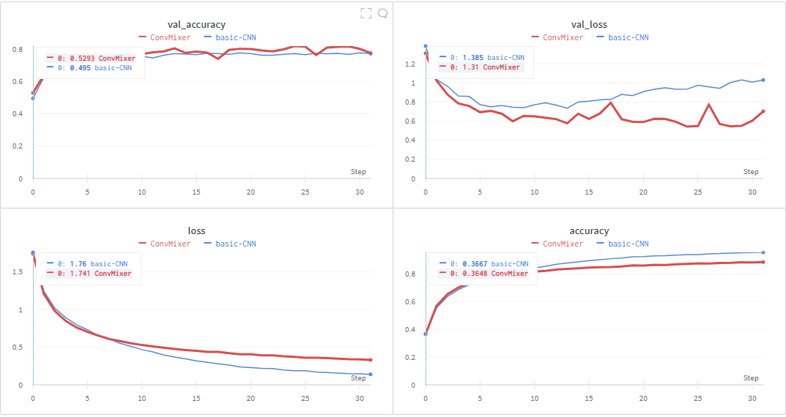

# Image Classification On CIFAR-10 Dataset
Burhanuddin Rangwala - 1911109
Mihir Pandya - 1911098

## Introduction:
In this project we create a robust image classification pipeline to classify images.
We created 2 different models and recorded their accuracy and loss.

## Dataset:
The dataset used in this project is the CIFAR-10 dataset which consists of 60000 32x32 colour images in 10 classes, with 6000 images per class. There are 50000 training images and 10000 test images.

## Models:

### Basic CNN
This is a basic CNN model which uses 2D convolution layers with an increasing amount of filters. Max pooling and Batch normalization are used as regularization techniques.
The total number of parameters is ~4.4 million.

### ConvMixer
This is the novel ConvMixer model which uses image patches which are synonymous to word embeddings in NLP as input. The model uses a conv-mixer layer which is nothing but a residual depthwise convolution followed by a pointwise convolution i.e. depthwise separable convolution. This layer is repeated a certain number of times.
The total number of parameters in this model is ~1.1 million.

## Graphs

